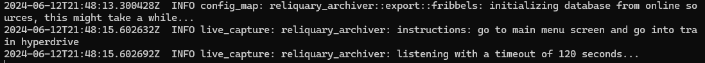

# reliquary-archiver

_tool to create a relic export from network packets of a certain turn-based anime game_

json output format is based on the format of [HSR-Scanner](https://github.com/kel-z/HSR-Scanner)

made to be used with [fribbels hsr optimizer](https://github.com/fribbels/hsr-optimizer)

## run

- requires [npcap](https://npcap.com/) (windows) or `libpcap` (linux)
    - when installing on windows, make sure to enable the "winpcap api-compatible mode".
      if this is grayed out for you, see [here](https://github.com/IceDynamix/reliquary-archiver/issues/2)
      for more details
        - if you use wifi, enable `Support raw 802.11 traffic (and monitor mode) for wireless adapters`
    - when building on Linux, set the `CAP_NET_RAW` capability on the resulting executable (
      via [pcap(3pcap)](https://man.archlinux.org/man/pcap.3pcap#Under~5))
      ```sh
      sudo setcap CAP_NET_RAW=+ep target/release/reliquary-archiver
      ```
- download latest release from [here](https://github.com/IceDynamix/reliquary-archiver/releases/)
- **Launch the game and get to this screen. Do not go into the game yet**
  
- run the archiver executable and wait until it says "listening with a timeout"
  
- start the game
- if successful, the archiver should output a file to `archiver_output.json`
  

you might have to disable your VPN or enable/disable wifi!

### cli usage

```
Usage: reliquary-archiver.exe [OPTIONS] [OUTPUT]

Arguments:
  [OUTPUT]  Path to output .json file to, per default: archive_output-%Y-%m-%dT%H-%M-%S.json

Options:
      --pcap <PCAP>              Read packets from .pcap file instead of capturing live packets
      --timeout <TIMEOUT>        How long to wait in seconds until timeout is triggered for live captures [default: 120]
  -v, --verbose...               How verbose the output should be, can be set up to 3 times. Has no effect if RUST_LOG is set
  -l, --log-path <LOG_PATH>      Path to output log to
      --no-update                Don't check for updates, only applicable on Windows
      --auth-token <AUTH_TOKEN>  Github Auth token to use when checking for updates, only applicable on Windows
  -h, --help                     Print help
```

to customize logging, either

- set the verbose flags
- or set `RUST_LOG` env variable to customize logging,
  see [here](https://docs.rs/tracing-subscriber/latest/tracing_subscriber/filter/struct.EnvFilter.html#directives)

to output logs to a file, provide `--log-path <path>`. file logs will always be trace-level.

## build from source

- follow instructions [here](https://github.com/rust-pcap/pcap?tab=readme-ov-file#building)
    - for me on windows, adding the `Packet.lib` and `wpcap.lib` from the sdk (check the x64 or arm dir)
      to this directory was enough to link successfully
- `cargo build` / `cargo run`

note that the necessary resource files are downloaded in the build script (`build.rs`) and compiled into the binary.

## related projects

want to do more with packet parsing? check out the
[standalone library](https://github.com/IceDynamix/reliquary) the archiver is built on top off!

looking to export your achievements? check out [stardb-exporter](https://github.com/juliuskreutz/stardb-exporter)!